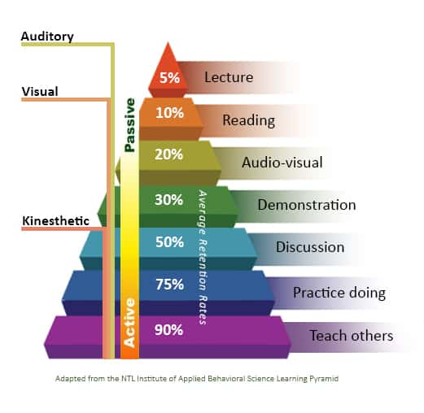

Studies show that varying your study methods and materials will improve your retention and recall of information, and enhance your learning experience.

The “learning pyramid”, sometimes referred to as the “cone of learning”, developed by the National Training Laboratory, suggests that most students only remember about 10% of what they read from textbooks, but retain nearly 90% of what they learn through teaching others.

The Learning Pyramid model suggests that some methods of study are more effective than others and that varying study methods will lead to deeper learning and longer-term retention.
The Learning Pyramid
Contents show
Lecture

The Learning Pyramid suggests that “Lecture” is one of the most ineffective methods for learning and retaining information. Lecture is a passive form of learning where you simply sit back and listen to information being spoon fed to you by your teacher or professor.

Attempting to acquire information and gain understanding only through lectures is not the most effective way of learning. However, auditory learners tend to find lectures more stimulating and educational than students who have non-auditory learning styles. Lectures are most effective when students arrive to class prepared, actively participate in class discussion, and take good notes.
Reading

While more effective than Lecture, Reading is still one of the less effective methods for acquiring and retaining information, according to the Learning Pyramid. However, if you are a visual learner, reading textbooks will likely be a more effective learning method for you than for students with non-visual learning styles.

Notwithstanding, reading textbooks is a necessary (and required) method of study in most academic settings. There are several strategies for reading textbooks that can greatly improve your ability to retain and recall what you read in your textbook.
Audio-visual

The Learning Pyramid suggests that Audio-visual learning methods only lead to a 20% retention of information learned. The audio-visual learning method may incorporate various audio-visual learning/teaching tools including videos, sound, pictures, and graphs.

However, as media and computer technology continues to evolve, new forms of audio-visual instruction are leading to more effective learning and retention of material. The effectiveness of audio-visual learning and study methods are enhanced when combined with other, more active forms of study.
Demonstration

Demonstration usually involves the teacher or professor providing students a learning task that they can observe. Within the structure of the Learning Pyramid, Demonstration is the first of the seven study methods that involves active learning.

Demonstration tends to offer students less ambiguity than passive study methods and leads to fewer misconceptions and greater understanding. Demonstration can be an effective study method, especially when information is ambiguous or confusing.
Discussion

Discussion, or “Group Discussion”, is a form of Cooperative Learning. It is also an active study method that can lead to greater retention of information and material studied, and higher academic achievement.

Unlike competitive and individualistic approaches to learning and studying, Discussion is a cooperative learning method that relies on students interacting and studying material with other students and instructors. Discussion Groups are intended to stimulate student thinking, and increase participation and engagement. Discussion can occur within a classroom setting or by forming a study group.
Practice (by) doing

Practice by doing, a form of “Discover Learning”, is one of the most effective methods of learning and study. This method of study encourages students to take what they learn and put it into practice – whereby promoting deeper understanding and moving information from short-term to long-term memory.

Practice by doing makes material more personal, and thus more meaningful to students. Practice by doing also leads to more in-depth understanding of material, greater retention and better recall.
Teach others

The key to subject mastery is teaching it to others. If you’re able to accurately and correctly teach a subject to others, you’ll have a very good mastery of the concepts, and superior retention and recall. According to the Learning Pyramid model, students are able to retain abou 90% of what they’re able to teach to others.

The most common form of teaching others is Peer Tutoring. However, the best place to teach others is in a study group. One of the main activities that should occur in an effective study group is peer to peer teaching, where each group member takes the opportunity to teach the other group members the course material being studied.
Conclusions

The effectiveness of any learning method, as presented in the Learning Pyramid, will also be influenced by your own unique learning style. Some students retain and recall information best through visual (spacial) learning, while others are aural (auditory) learners. To maximize the effectiveness of your studying, discover your learning style.

Also, remember that the key here is to vary your method of learning. Don’t assume just because the Learning Pyramid suggests that Lectures are the least effective study method for retaining information, that lectures aren’t important.

Lectures are still very important. Each of the learning methods presented in the Learning Pyramid are important. Even if it’s difficult for you to remember everything that is taught during lectures, the notes you take during lecture may be vital to your ability to participate in a discussion of the material later on in your group, or teach the material to others.

Vary your study method and focus on the methods and learning styles that yield the best results for you.
